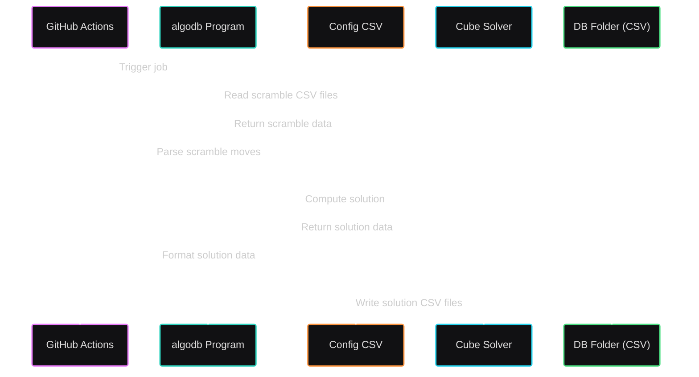

# algodb

A Go-based tool to find all possible solutions of different Rubik’s Cube states. It reads scramble sequences from CSV files, computes solutions using a solver, and saves the results back to CSV in a `db` folder. The process is automated via GitHub Actions.

Users can find the computed algorithms in the [db](db) folder, which is automatically generated by [GitHub Actions](https://github.com/BattlefieldDuck/algodb/actions).

## License

This project is licensed under the GNU General Public License v3.0. See the [LICENSE](LICENSE) file for details.
